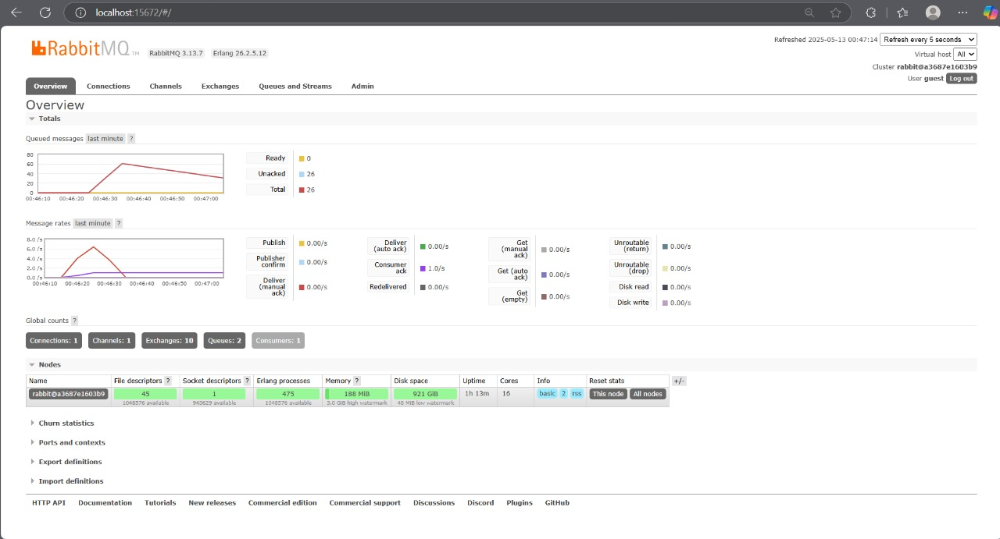
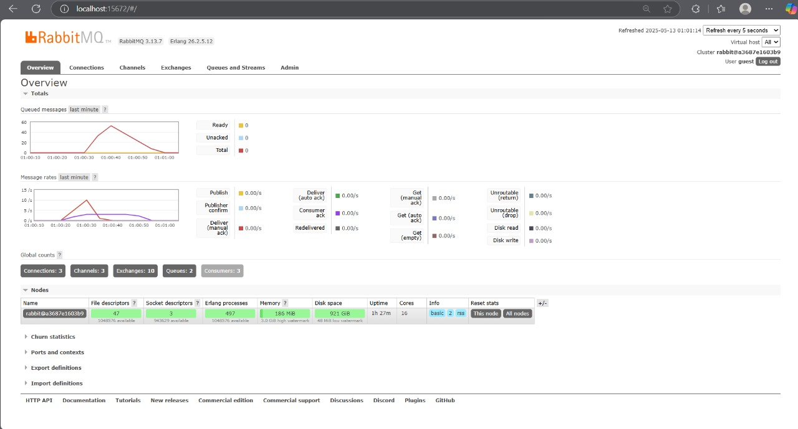
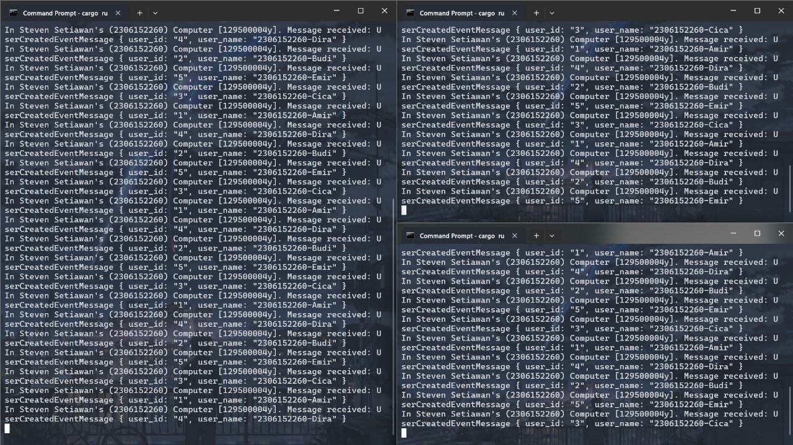

# Reflection
Steven Setiawan - 2306152260

> What is **_amqp_**?

AMQP (_Advanced Message Queuing Protocol_) adalah protokol pesan yang memungkinkan aplikasi klien berkomunikasi dengan _message broker_ yang mengimplementasikan protokol tersebut. Protokol ini dirancang untuk menjadi protokol pengiriman pesan yang efisien dan fleksibel dalam pertukaran data antar aplikasi. AMQP memfasilitasi komunikasi antara aplikasi melalui _middleware_ pesan, di mana klien dapat menerima data yang mereka butuhkan.

> What does it mean? **guest:guest@localhost:5672** , what is the first **_guest_**, and what is the second **_guest_**, and what is **_localhost:5672_** is for?

Dalam format koneksi AMQP, bagian **_guest_** pertama adalah username yang digunakan untuk proses authentication ke server RabbitMQ. Bagian **_guest_** kedua adalah password yang diperlukan untuk verifikasi akses pengguna tersebut. Sementara itu, **_localhost_** merujuk pada hostname server yang menjalankan _message broker_ (dalam hal ini perangkat lokal kita sendiri), dan "5672" adalah nomor port _default_ yang digunakan oleh protokol AMQP untuk melakukan koneksi.

## Simulation Slow Subscriber

Pada gambar tersebut, terlihat ada 60 pesan yang menumpuk dalam _queue_ karena subscriber membutuhkan waktu yang lebih lama untuk memproses setiap event dibandingkan dengan kecepatan publisher dalam mengirimkan pesan. Penumpukan ini terjadi karena ketidakseimbangan antara kecepatan produksi dan konsumsi pesan dalam sistem _message broker_.

## Running at Least Three Subscribers

Berdasarkan gambar pertama tersebut, terlihat bahwa _queue_ dikonsumsi dengan kecepatan yang jauh lebih tinggi karena terdapat tiga konsumer (_subscriber_) yang secara bersamaan mengambil pesan dari _queue_, sehingga jumlah pesan dalam antrian berkurang secara signifikan. Pada gambar kedua, dapat diamati bahwa _message broker_ berhasil menyeimbangkan beban dengan mendistribusikan pesan-pesan kepada ketiga konsumer secara merata, di mana setiap konsumer menerima pesan yang berbeda-beda dan pesan yang telah diambil akan dihapus dari _queue_.